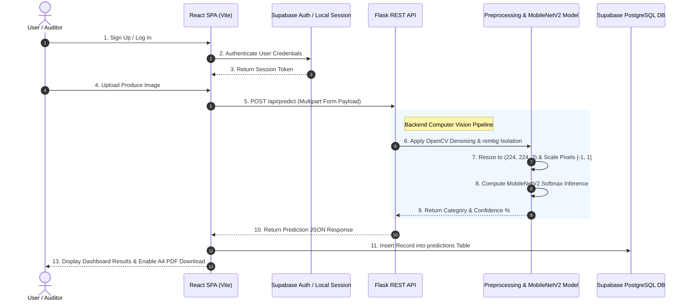

# 🔬 FreshScan – AI Pesticide & Produce Quality Detection System

[](https://react.dev/)
[](https://flask.palletsprojects.com/)
[](https://tensorflow.org/)
[](https://supabase.com/)
[](LICENSE)

**FreshScan** is an end-to-end AI-powered computer vision and deep learning application designed to detect surface chemical treatments, wax coatings, and pesticide residue probability on agricultural produce (such as apples, tomatoes, and fruits) using fine-tuned **MobileNetV2 Convolutional Neural Networks (CNNs)** and **OpenCV image preprocessing**.

---

## 🌟 Key Features

- 🥑 **Deep Learning Classification:** Fine-tuned MobileNetV2 CNN classifier detecting 4 granular produce safety categories:
  - *Healthy / Organic Produce* (Low Risk)
  - *Surface Wax / Light Treatment* (Moderate Risk)
  - *Post-Harvest Chemical Spray* (Moderate Risk)
  - *High Pesticide Residue* (High Risk)
- 🧹 **Advanced Image Preprocessing:**
  - **OpenCV Denoising:** `fastNlMeansDenoisingColored` strips camera sensor noise.
  - **Background Isolation:** `rembg` (u2net ONNX) segments target produce from background artifacts.
- 🔐 **Secure Cloud Authentication & Row Level Security:**
  - Powered by **Supabase Auth** with full profile metadata storage.
  - PostgreSQL **Row Level Security (RLS)** ensuring strict user data isolation.
- ⚡ **Zero-Downtime Offline Demo Mode:**
  - Fallback local storage session (`fs_local_session`) guarantees 100% uptime during live panel presentations without cloud dependence.
- 📄 **Tabular A4 PDF Certificate Exporter:**
  - Formats inspection logs into print-optimized portrait A4 laboratory certificates via `html2canvas` and `jsPDF`.

---

## 🏗️ System Architecture & Workflow



---

## 💻 Tech Stack

| Layer | Technologies Used |
| :--- | :--- |
| **Frontend UI** | React 19, Vite 8, React Router DOM 7, Tailwind CSS 3, Lucide React, Material Symbols |
| **Backend API** | Python 3, Flask REST API, Flask-CORS, Gunicorn |
| **ML & Vision** | Keras 3 / PyTorch, TensorFlow MobileNetV2, OpenCV (`cv2`), `rembg`, Pillow |
| **Database & Auth** | Supabase Cloud PostgreSQL, Row Level Security (RLS), Supabase Auth Client |
| **Reporting** | Client-Side `html2canvas` + `jsPDF` A4 Export Engine |

---

## 🚀 Quickstart & Local Setup

### 1. Clone the Repository
```bash
git clone https://github.com/nmit-1nt23cs102/AI-Pesticide-Detection-System.git
cd AI-Pesticide-Detection-System
```

### 2. Backend Setup (Flask Server)
```bash
cd backend
python -m venv venv
# On Windows:
.\venv\Scripts\activate
# On Linux/macOS:
source venv/bin/activate

pip install -r requirements.txt
python app.py
```
*Backend will start on `http://localhost:5000`.*

### 3. Frontend Setup (React SPA)
Open a new terminal window:
```bash
cd frontend
npm install
npm run dev
```
*Frontend will start on `http://localhost:5173`.*

---

## 🔑 Environment Variables Configuration

Create a `.env` file inside the `frontend/` directory:

```env
VITE_SUPABASE_URL=https://qlgvksohknzmnoyffokw.supabase.co
VITE_SUPABASE_ANON_KEY=your-supabase-public-anon-key
```

---

## 🗄️ Database Schema (`supabase_schema.sql`)

```sql
create table public.predictions (
  id uuid default gen_random_uuid() primary key,
  user_id uuid references auth.users not null,
  category text not null,
  confidence numeric not null,
  model_used text,
  image_url text,
  created_at timestamp with time zone default timezone('utc'::text, now()) not null
);

alter table public.predictions enable row level security;

create policy "Users can insert their own predictions."
  on predictions for insert with check ( auth.uid() = user_id );

create policy "Users can view their own predictions."
  on predictions for select using ( auth.uid() = user_id );
```

---

## 🌐 Production Deployment

- **Frontend:** Deployed via [Vercel](https://vercel.com/) (Root: `frontend`, Framework: `Vite`).
- **Backend API:** Deployed via [Render](https://render.com/) (Root: `backend`, Build: `pip install -r requirements.txt`, Start: `gunicorn app:app`).
- **Database:** Hosted on [Supabase Cloud](https://supabase.com/).

---

## 📋 Academic Rubric Alignment Summary

- **Problem Statement & Scope (5 Marks):** Problem refined from raw image classification to structured multi-stage quality analysis with explicit scope boundaries.
- **Architecture & Design (15 Marks):** Documented decoupled architecture, sequence diagrams, design patterns (MVC, Strategy Pattern for Offline Mode, RLS Security), and trade-off analysis (*MobileNetV2 vs ResNet50*).

---

## 📄 License

Distributed under the **MIT License**. See `LICENSE` for more information.